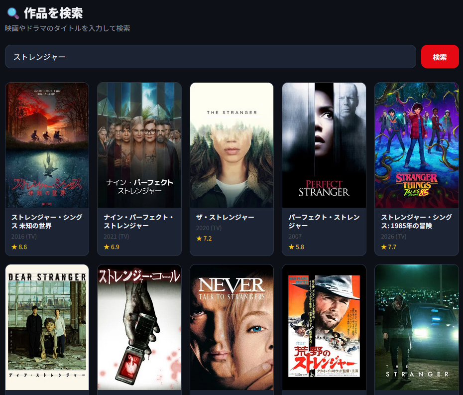
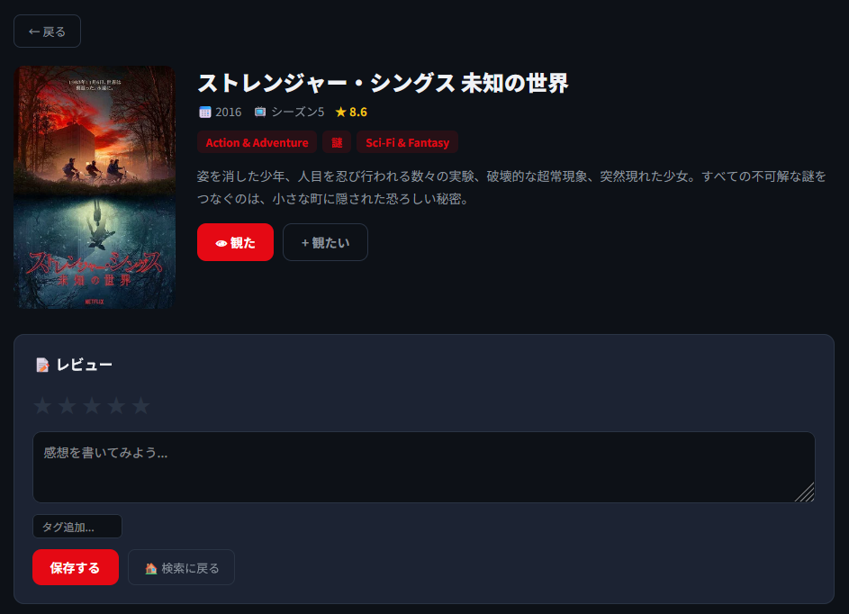
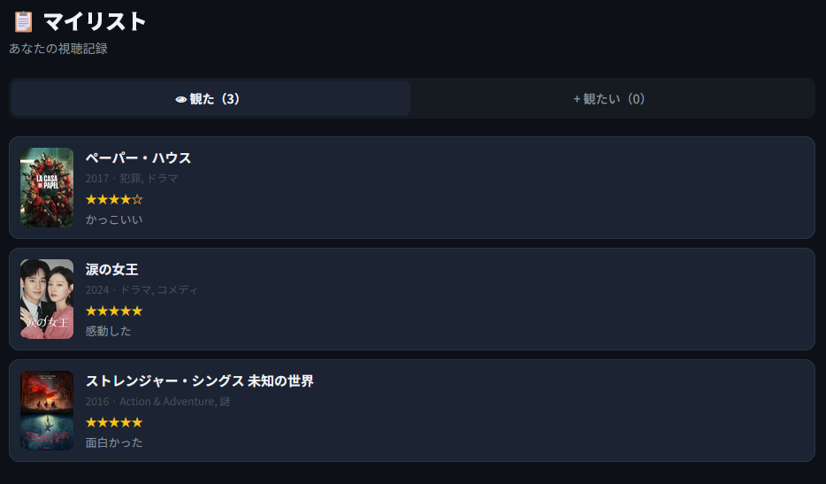
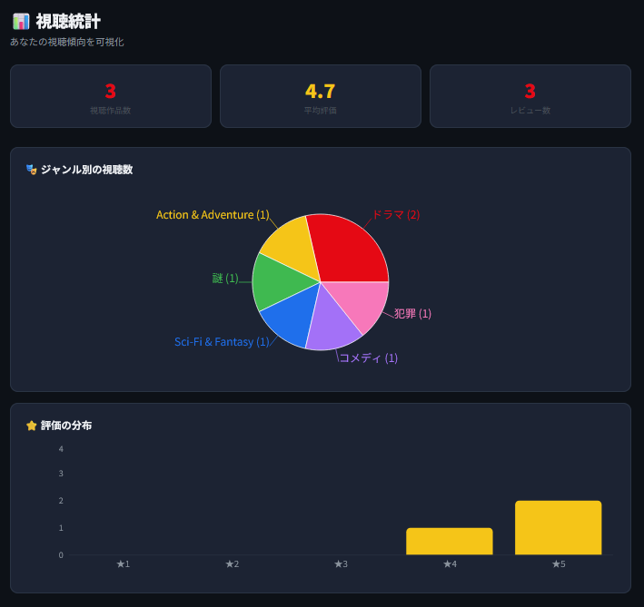

# 🎬 WatchLog

映画の視聴記録＆レビュー管理アプリ

🔗 **Demo**：https://hayashi-12.github.io/watch-log/

🔗 **GitHub**：https://github.com/Hayashi-12/watch-log

## 📸 アプリ画面

### 検索画面


### 作品詳細・レビュー


### マイリスト


### 視聴統計


---

## 🎬 概要

「WatchLog」は、観た映画を記録し、評価・感想・タグをつけて管理できるWebアプリです。
TMDB APIから映画情報をリアルタイムに取得し、ポスター画像やあらすじを表示。自分だけの視聴ログを作成できます。

---

## 🎯 開発の背景

Netflixで映画を観ることが趣味ですが、「あの映画面白かったっけ？」「前に観たあの作品のタイトルが思い出せない」ということがよくありました。

1作目のポートフォリオ「6th Man」をVanilla JavaScriptで開発した経験を活かし、2作目ではReact + 外部API連携に挑戦。技術的なステップアップと、自分が本当に使いたいアプリの開発を両立しました。

---

## ✨ 主な機能

### 作品検索
TMDB APIに映画タイトルを送信し、ポスター画像・あらすじ・公開年・評価をリアルタイムに取得して表示します。

### 作品詳細・レビュー
作品ごとに5段階の星評価、感想テキスト、自由なタグ（「泣ける」「一気見した」など）を記録できます。あとから編集・削除も可能です（CRUD操作）。

### マイリスト
「観た」「観たい」の2つのタブで記録を管理。保存日が新しい順に並び、タップすると詳細ページに遷移します。

### 視聴統計ダッシュボード
記録が溜まると自動集計され、ジャンル別の視聴数を円グラフ、評価分布を棒グラフで可視化します。

---

## 🛠 使用技術

| 技術 | 用途 |
|---|---|
| React | コンポーネントベースのUI構築 |
| React Router | 検索 → 詳細 → マイリストのページ遷移（SPA） |
| TMDB API | 映画情報のリアルタイム取得（fetch + async/await） |
| Recharts | ジャンル別円グラフ・評価分布棒グラフの描画 |
| LocalStorage | 視聴記録・レビューのデータ永続化（JSON形式） |
| Vite | 高速な開発サーバーとビルドツール |
| GitHub Pages | アプリのホスティング・公開 |

---

## 💡 工夫した点

### 外部APIとの非同期通信
TMDB APIからのデータ取得にasync/awaitを使用し、ローディング表示やエラーハンドリングを実装。通信中はスピナーを表示し、ユーザーに待機状態を伝えるUI設計にしました。

### コンポーネント分割による設計
SearchPage・DetailPage・MyListPage・StatsPageの4つのページコンポーネントに分離。1作目の6th Manでは1ファイルに全コードを書いていましたが、Reactのコンポーネント設計を学び、保守性と再利用性を意識した構成に進化させました。

### CRUD操作の実装
視聴記録の作成・読み取り・更新・削除をLocalStorageで実装。同じ作品の記録は上書き、不要な記録は削除できる設計にし、実務で頻出するデータ操作のパターンを経験しました。

### アプリのデザイン統一
保存完了時のトースト通知、ページ遷移時のフェードインアニメーション、スクロール位置のリセットなど、細部のUXを丁寧に仕上げました。

---

## 📁 ファイル構成

```
watch-log/
├── src/
│   ├── App.jsx              # ルーティングとレイアウト
│   ├── App.css              # 全体のスタイル
│   ├── main.jsx             # エントリーポイント
│   └── components/
│       ├── SearchPage.jsx   # 作品検索（API通信）
│       ├── DetailPage.jsx   # 作品詳細・レビュー（CRUD）
│       ├── MyListPage.jsx   # マイリスト（タブ切替）
│       └── StatsPage.jsx    # 統計ダッシュボード（グラフ）
├── index.html
├── vite.config.js
└── package.json
```

---

## 🚀 ローカルでの実行方法

```bash
git clone https://github.com/Hayashi-12/watch-log.git
cd watch-log
npm install
npm run dev
```

ブラウザで `http://localhost:5173/` を開くとアプリが起動します。

---

## 📌 ポートフォリオとしての位置づけ

| | 1作目：6th Man | 2作目：WatchLog |
|---|---|---|
| 構成 | Vanilla JS（1ファイル） | React（コンポーネント分割） |
| データ | 自前で定義 | 外部API（TMDB） |
| 画面遷移 | JSで表示切替 | React Router（SPA） |
| グラフ | Chart.js | Recharts |
| 公開 | GitHub Pages（静的） | GitHub Pages（ビルド＋デプロイ） |

1作目でHTML/CSS/JavaScriptの基礎を固め、2作目でReact・外部API連携・コンポーネント設計に挑戦しました。
